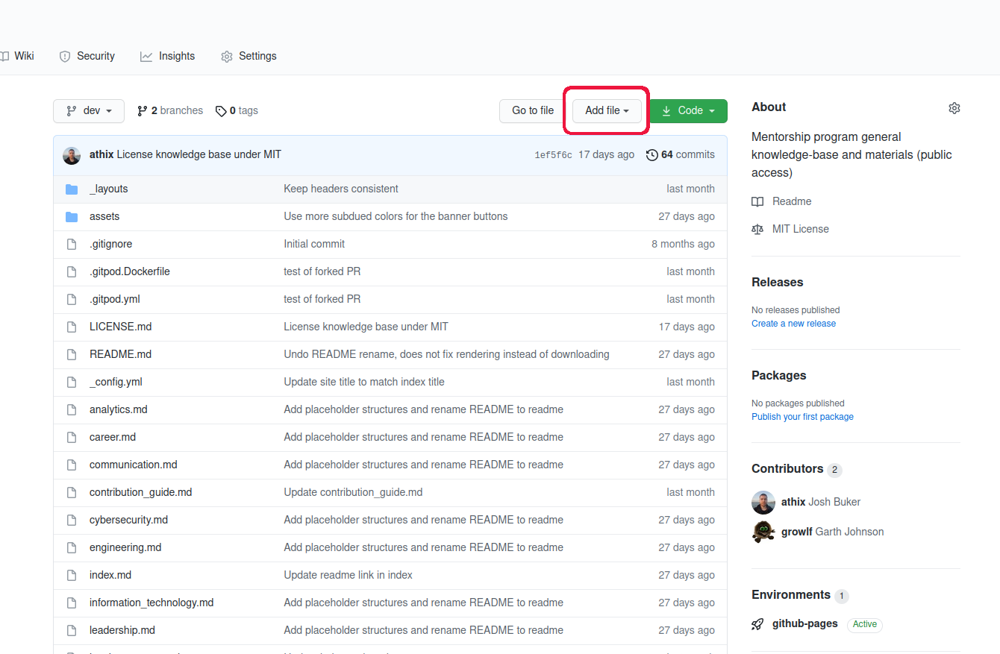
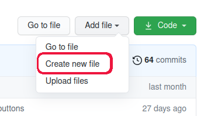
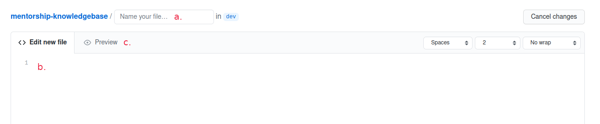
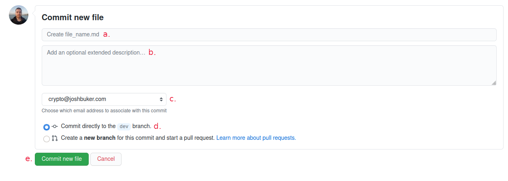

# Contribution Guide

* [Recommendations](#recommendations)
* [What is the structure of the knowledgebase?](#what-is-the-structure-of-the-knowledgebase)
  * [What are the differences between the types of resources?](#what-are-the-differences-between-the-types-of-resources)
* [How to add articles, books, and websites](#how-to-add-articles-books-and-websites)

## How to add/edit files

### Adding a new file

You can click on the following link to skip to step 4 of the process:
[Create new File](https://github.com/tagnw/mentorship-knowledgebase/new/dev)

1. Go to the root of the repository: [tagnw/mentorship-knowledgebase](https://github.com/tagnw/mentorship-knowledgebase)
1. [Click on `Add file`](#add-file-step-2)
1. [Click on `Create new file`](#add-file-step-3)
1. [Begin adding your file](#add-file-step-4)
   * **a.** Enter in the filename that you would like to use. A forward slash `/` will create a folder. Example: `folder-name/file_name.md` will create the file "file_name.md" in folder "folder-name".
   * **b.** Type the contents of the file, see the rest of the contribution guide for formatting recommendations.
   * **c.** To preview what the file will look like when rendered, click on `Preview`.
1. [When ready to add your changes, scroll down to commit them.](#add-file-step-5)
   * **a.** You may leave this unchanged.
   * **b.** Optionally, you can add some additional information on why you're adding this file, or any other related notes.
   * **c.** Choose which email you want to commit with.
      * **This email will be visible to the public. Do not use a private email address!**
      * You can add/change your email addresses under your account settings.
   * **d.** You may leave this unchanged.
   * **e.** When ready, click `Commit new file`

### Editing an existing file

TODO

## General Recommendations

* When in doubt, just contribute and don't worry about formatting.

## Naming Conventions

* Always spell out abbreviations when used for the first time on a page.
* Use a hyphen instead of a space in folder names.
* Use an underscore instead of a space in filenames.

## What is the structure of the knowledgebase?

### What are the differences between the types of resources?

* A website is a page of an online resource, e.g. https://tagnw.org or https://tagnw.org/mentorship
* An article is a post with content on a specific topic, e.g. https://www.tagnw.org/tag-2021-membership-and-sponsorship-changes/
* A book is a book, often acquirable in physical form. e.g. [Tautology for dummies](https://youtu.be/izGwDsrQ1eQ)
* An online community is often a subpage of a website, such as https://reddit.com/r/bellingham, or a communication group like Discord, Slack, etc.
* Other is any resource that does not neatly fit under one of the other resource types.

## How to add articles, books, and websites

General Recommendations:
* For expanded commentary please create a new page.
* Crossposting is encouraged. Please use the Article Format below.
* Any forprofit interest must be acknowledged in the Description.

Article and Media (Audio, Video) Format:
* Title
* Author
* Official Link
* Description (<100 words)
* Commentary (<100 words)

Book Format:
* Title
* Author
* ISBN-13
* Official Website or Goodreads Link
* Purchase Link (Nonprofit or Charity links such as Amazon Smile, if possible.)
* Description (<100 words)
* Commentary (<100 words)

Website and Online Community Format:
* Name
* Link
* Description (<100 words)
* Commentary (<100 words)
